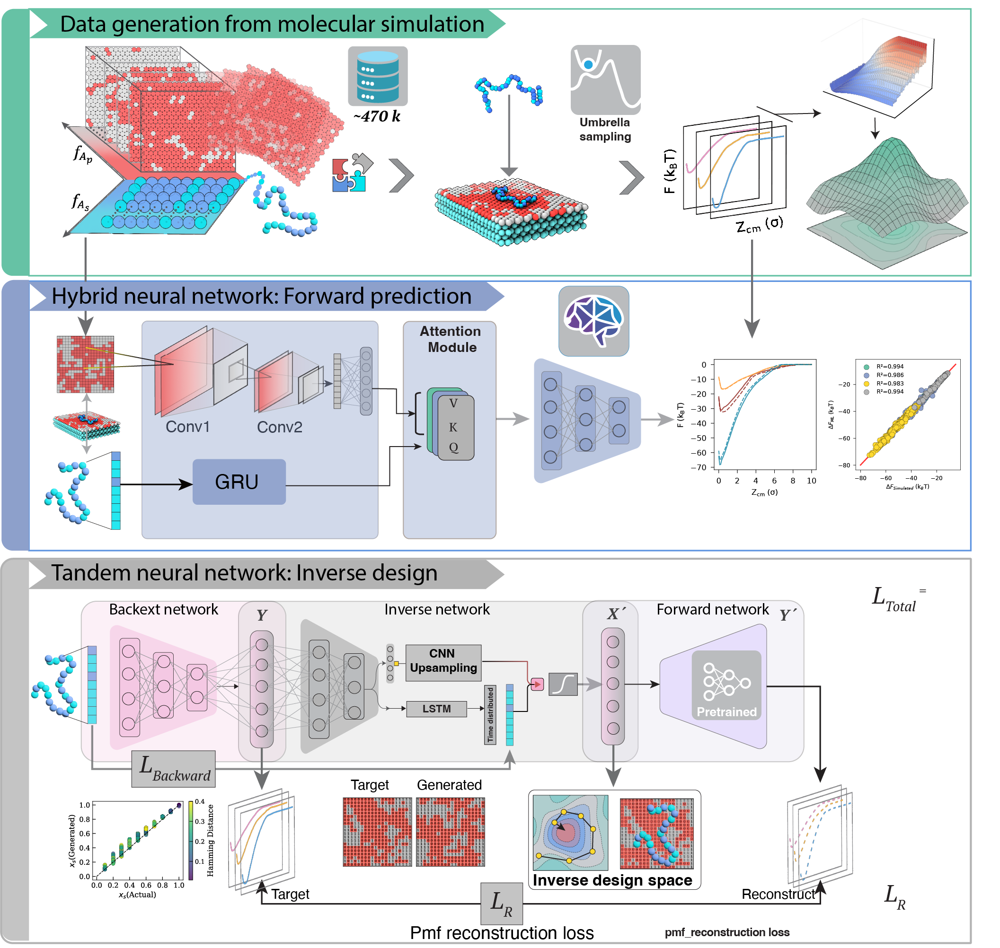
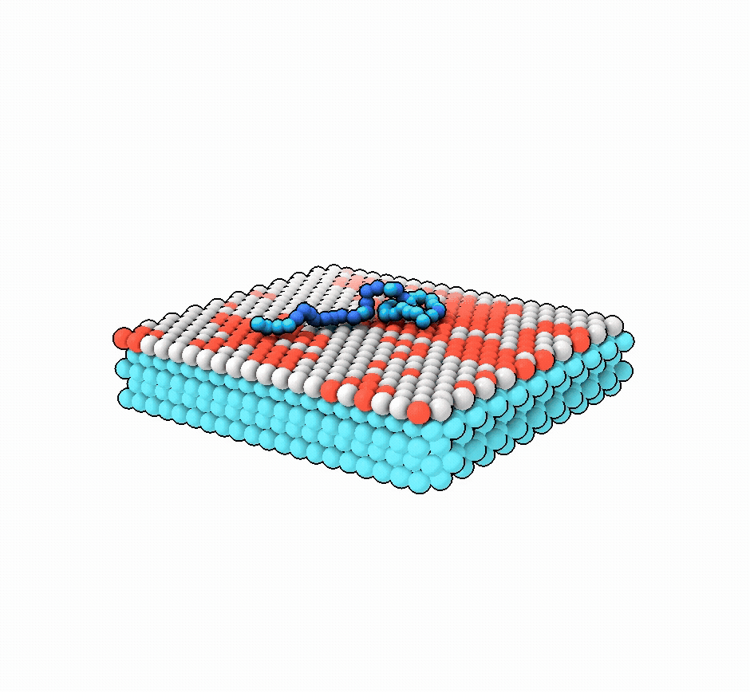
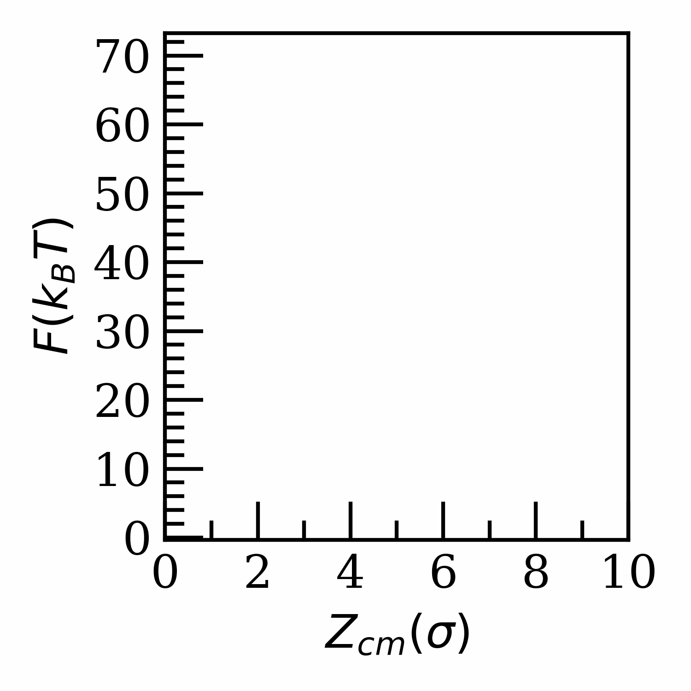
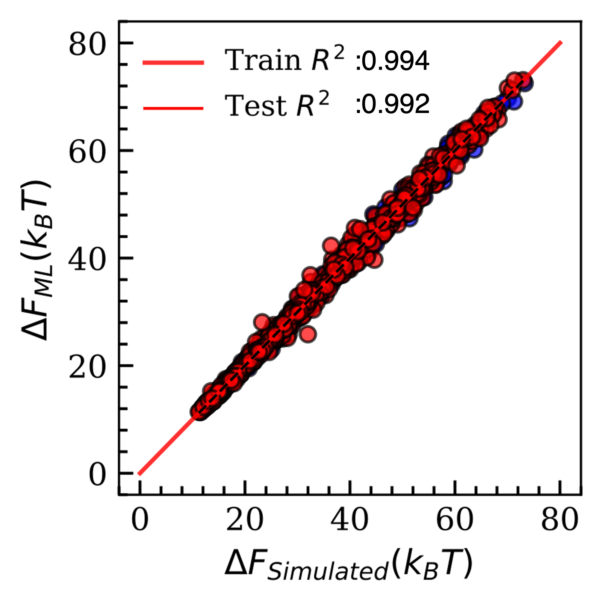

# Molecular Dynamics Guided Engineering of Polymer-Surface Adhesion Using Hybrid Network Models

This repository contains a machine learning model for predicting the **Potential of Mean Force (PMF) profiles** of polymer-surface interactions using enhanced sampling data from Umbrella Sampling (US). The input to the neural network consists of **one-hot encoded polymer-surface representations** along with fractional compositions.



---
## Overview
Understanding polymer–surface adhesion is crucial for designing functional nanomaterials and therapeutic systems.  
Traditionally, **PMF profiles** are computed using **umbrella sampling (US)**, but this is computationally expensive.  

Approach:
-**Generates polymer and surface configurations** using a **2D and 1D Monte Carlo Ising model** while preserving the overall **fractional composition**.  
  This ensures physical relevance and systematic generation of the sequence–pattern design space.
- Encodes **polymer sequences** and **surface patterns**
- Uses a **CNN–GRU–Attention hybrid model** to capture both **spatial heterogeneity** and **sequence dependence**.
- Predicts **full PMF profiles** directly, enabling rapid screening of polymer–surface combinations.

<table>
<tr>
<td></td>
<td></td>
<td></td>
</tr>
</table>
## Repository Layout

| `data/` | See `data/README.md`. |
| `scripts/` 
| `src/` | ML pipeline (see README.md for detailed explanation). |
| `configs/` |  Files for MD system generation. |
| `examples/`

## Installation

```bash
git clone https://github.com/siba-p/ML_surfacepoly.git
cd ML_surfacepoly
python -m venv .venv
source .venv/bin/activate
pip install -r requirements.txt
```

> Note: set `PYTHONPATH=$(pwd)` (or use `pip install -e .`) so `src/` modules resolve without any changes.

## Workflow

1. **Generate datasets** :

  ```bash
  python -m scripts.save_data  # writes to data/splits/
  ```

  The helper accepts the `neural_tag` argument inside `scripts/prepare_model_data.py` if you need `augmented` or `mixed` tensors.

2. **Train the forward model** using CLI:

  ```bash
  python -m src.cli.train_forward \
    --neural-tag canonical \
    --model hybrid \
    --epochs 2000 \
    --checkpoint models/checkpoint/HybridCNN/canonical_forward_model.keras \
    --history-out models/history/forward_canonical.npy
  ```

3. **Train the backward model** :

  ```bash
  python -m src.cli.train_backward \
    --forward-checkpoint models/checkpoint/HybridCNN/canonical_forward_model.keras \
    --train-seq data/splits/fdX_train.npy \
    --train-pmf data/splits/fdY_train.npy \
    --valid-seq data/splits/fdX_valid.npy \
    --valid-pmf data/splits/fdY_valid.npy \
    --checkpoint models/checkpoint/HybridCNN/canonical_backward_model.keras
  ```

4. **Run the tandem + extension pipeline** for inverse design (requires the auxiliary `bxX_*` tensors described in the notebook):

  ```bash
  python -m src.cli.train_extended \
    --forward-checkpoint models/checkpoint/HybridCNN/canonical_forward_model.keras \
    --sequence-train data/splits/fdX_train.npy \
    --pmf-train data/splits/fdY_train.npy \
    --extra-train data/splits/bxX_train.npy \
    --sequence-valid data/splits/fdX_valid.npy \
    --pmf-valid data/splits/fdY_valid.npy \
    --extra-valid data/splits/bxX_valid.npy
  ```

5. **Inference** on any encoded sequences:

  ```bash
  python -m src.cli.predict_forward \
    --checkpoint models/checkpoint/HybridCNN/canonical_forward_model.keras \
    --inputs data/processed/fdX_test.npy \
    --outputs models/predictions.npy
  ```

All CLIs emit both checkpoints (`--checkpoint`) and serialized histories (`--history-out`) for reproducible.

## Utilities

- The table in `scripts/README.md` documents each preprocessing helper; refer it when extending augmentation strategies.
- Detailed dataset explanation is in `data/README.md` and how to generate `.npy`.

