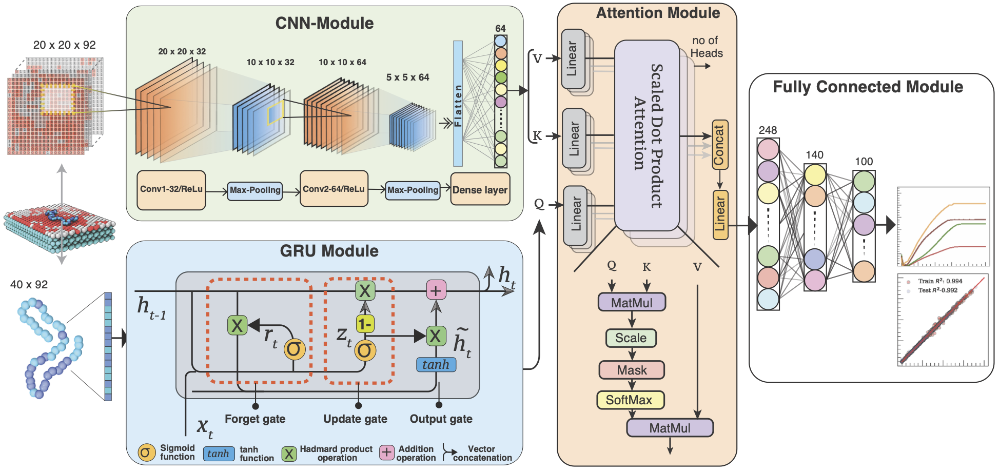

# MD-informed Attention-based Hybrid Network for Predicting Polymer-Surface Adhesion

This repository contains a machine learning model for predicting the **Potential of Mean Force (PMF) profiles** of polymer-surface interactions using enhanced sampling data from Umbrella Sampling (US). The input to the neural network consists of **one-hot encoded polymer-surface representations** along with fractional compositions.



---
## 📌 Project Overview
Understanding polymer–surface adhesion is crucial for designing functional nanomaterials and therapeutic systems.  
Traditionally, **PMF profiles** are computed using **umbrella sampling (US)**, but this is computationally expensive.  

Our approach:
-**Generates polymer and surface configurations** using a **2D and 1D Monte Carlo Ising model** while preserving the overall **fractional composition**.  
  This ensures physical relevance and systematic coverage of the sequence–pattern design space.
- Encodes **polymer sequences** and **surface patterns** (one-hot + fractional compositions).
- Uses a **CNN–GRU–Attention hybrid model** to capture both **spatial heterogeneity** and **sequence dependence**.
- Predicts **full PMF profiles** directly, enabling rapid screening of polymer–surface combinations.


## 📂 **Repository Structure**
gen_scripts/ # Dataset generation scripts
ising_generate.py # Generate binary surfaces,polymers by 2D, 1D Monte-carlo Ising model
constructSurface.py # Generate heterogeneous surfaces .gro files
generatePolymer.py # Generate polymer sequences .gro files
createSimBox.py # Build MD simulation box
MD_inputfiles/ # Input files for MD simulations (umbrella sampling)

models/ # Neural network architectures (CNN, GRU, Transformer)
scripts/ # Data processing, analysis, utilities

#Additional scripts
###Run the script with different options to control the preprocessing steps:
```python
python preprocess.py
###This script supports command-line flags to enable or disable specific preprocessing steps:
python prepare_data.py
|  Flag           |  Options |  Default  |  Description                        |
|-----------------|----------|-----------|-------------------------------------|
|--reshape        |   Yes/No |     Yes   | Enable/disable data reshaping       |
|--surface-augment|   Yes/No |     Yes   | Enable/disable surface augmentation |
|--polymer-augment|   Yes/No |     Yes   | Enable/disable polymer augmentation |
```
---

---

## **Installation & Setup**
### **Clone the Repository**
```bash
git clone https://github.com/siba-p/ML_surfacepoly.git
cd ML_surfacepoly

Set Up a Virtual Environment (Recommended)

python -m venv env
source env/bin/activate  

Install Dependencies

pip install -r requirements.txt

```


Hyperparameter tuning

Modify config.yaml to fine-tune model settings:


👨‍💻 Contributing
Interested in improving the model? 

Open an issue
Submit a pull request
Suggest enhancements

